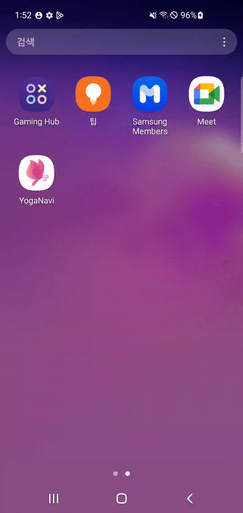
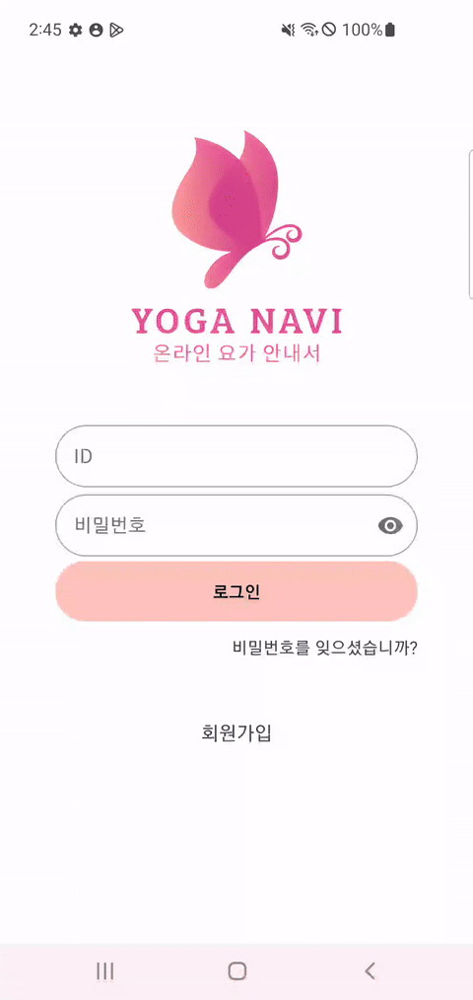
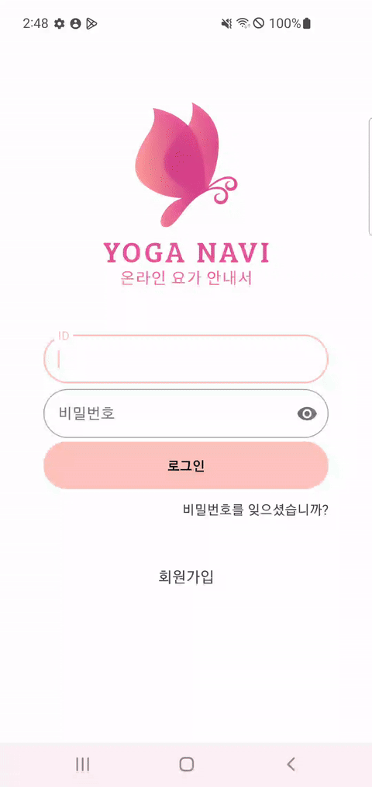

# 🧘‍♀️ YogaNavi


- 배포 URL: [여기를 클릭!](https://drive.google.com/file/d/195UohXwyjYp07eXYUQKVgrAC9LLTJkKY/view)
- Test ID: 1@example.com
- Test PW: 1

<br>

## 프로젝트 소개 및 핵심 기능

🧘 <b> 요가 강사와 수강생을 연결하는 모바일 요가 플랫폼입니다.

🔔 <b> FCM을 사용하여 화상강의 시작 10분 전에 알람을 받을 수 있습니다.

📱 <b> WebRTC를 사용하여 실시간 화상강의가 가능합니다.

🏆 <b> Yolo v8 pose estimation 모델을 사용하여 녹화강의에서 강사와 수강생의 자세를 비교하며 보여줍니다.

<br>

## 팀원 구성

<div align="center">

|               **강미연**                |                 **김은섭**                 |                 **서장원**                  |               **여창민**                |                **정다혜**                |                 **최승준**                 |
|:------------------------------------:|:---------------------------------------:|:----------------------------------------:|:------------------------------------:|:-------------------------------------:|:---------------------------------------:|
|                <b>백엔드                |                 <b>백엔드                  |                  <b>백엔드                  |               <b>안드로이드               |               <b>안드로이드                |                <b>안드로이드                 |
| [GitHub](https://github.com/422haha) | [Github](https://github.com/subway9852) | [Github](https://github.com/Seo-Jangwon) | [Github](https://github.com/yeolife) | [Github](https://github.com/JeongDaH) | [Github](https://github.com/Aloe-droid) |
</div>

<br>

## 1. 개발 환경

- Front-end: Android Studio, Kotlin, MVVM
- Back-end : IntelliJ, Spring boot
- Signaling Server: Kotlin, ktor
- 버전 및 이슈관리 : Gitlab, Jira
- 협업 툴 : Matter Most, Discord, Notion
- 서비스 배포 환경 : AWS EC2, Docker, Jenkins
- 디자인 : [Figma](https://www.figma.com/design/sMLjgI5OwHFt8tIS5ZyDBD/Yoga-Navi?node-id=0-1&t=nj03qnrp0J5vai0o-0)
- [커밋 컨벤션](https://aluminum-timpani-a63.notion.site/Git-3e8c00d26c7e4ef99fc79b9ad8dbe543?pvs=4)
- [코드 컨벤션](https://google.github.io/styleguide/javaguide.html)
- [주석 컨벤션](https://aluminum-timpani-a63.notion.site/Style-Guide-258f44c30eb44bddb34b892f0fcc6252?pvs=4)
<br>

## 2. 채택한 개발 기술과 브랜치 전략

### Android

- Hilt
	- 의존성 주입을 통해 객체의 생성을 관리함으로써 코드의 모듈화와 재사용성을 극대화할 수 있습니다.
- Retrofit2
	- 백앤드 서버와의 HTTP 요청을 인터페이스 메서드로 매핑하여, 네트워크 요청 로직을 직관적이고 쉽게 작성할 수 있습니다.
- Jetpack Navigation
	- Navigation Graph를 통해 앱 내 모든 탐색을 하나의 그래프로 관리할 수 있게 해주며, 이를 통해 UI 흐름을 시각적으로 설계할 수 있습니다.
- FCM
	- 사용자가 정해진 시간에 강의 알림을 받을 수 있어야 하기 때문에 Firebase을 활용하여 푸시알림을 받을 수 있게 하였습니다.
- WebRTC
    - 서버를 통하지 않고 브라우저 간의 P2P 통신을 지원함으로써 보다 빠른 통신이 가능한 환경을 구성하고자 했습니다.
-  Yolo v8 pose estimation
	- 수강생의 요가 자세의 정확도를 판별하기 위해  AI 모델을 활용했습니다. 정확도는 관절 간의 각도로 판별됩니다.
    
### Backend

- Redis
	- 자주 접근하는 데이터를 Redis에 캐싱함으로써 데이터베이스 조회 횟수를 줄여 전체 시스템 성능을 향상시킵니다.
	-   Redis는 디스크 기반 데이터베이스보다 훨씬 빠른 읽기/쓰기 속도를 제공합니다.
	-   일시적으로 필요한 데이터(예: 캐시된 강의 정보)를 저장하고 자동으로 만료시킬 수 있어 메모리 관리가 효율적입니다.
	-   Access token 검증, 강의 알림 전송 시 이 점을 고려하여 Redis에 관련 정보들을 캐싱하였습니다.
 - JPA 
    - 객체 지향적인 방식으로 데이터베이스를 조작할 수 있어, 사용자 정보나 강의 정보 등을 효율적으로 관리할 수 있습니다.
    - 복잡한 SQL 쿼리 없이도 간단하게 데이터를 조회하고 조작할 수 있습니다.
    - 엔티티 간의 관계를 쉽게 표현하고 관리할 수 있어, 강의와 사용자 간의 관계 등을 효과적으로 모델링할 수 있습니다.
 - Spring Security
    - URL 기반의 세밀한 접근 제어를 통해 선생님과 학생의 권한을 효과적으로 관리할 수 있습니다.
    - 커스텀 인증 제공자(UsernamePwdAuthenticationProvider)를 통해 이메일/비밀번호 기반의 인증 로직을 쉽게 구현할 수 있습니다.
    - JWT 토큰 검증 필터를 보안 필터 체인에 쉽게 추가하여 토큰 기반 인증을 구현할 수 있습니다.
 - JWT
    - 서버의 부하를 줄이고 확장성을 향상시키기 위해 세션 대신 토큰 기반 인증을 채택했습니다.
    - 토큰에 사용자 역할 정보를 포함시켜 효율적인 권한 관리가 가능합니다.
    - Redis를 활용한 토큰 저장 및 검증으로 빠른 인증 처리가 가능합니다.

### 브랜치 전략

- Git-flow 전략을 기반으로 main, develop 브랜치와 feature 보조 브랜치를 운용했습니다.
- main, develop, Feat 브랜치로 나누어 개발을 하였습니다.
    - **main** 브랜치는 배포 단계에서만 사용하는 브랜치입니다.
    - **develop** 브랜치는 개발 단계에서 git-flow의 master 역할을 하는 브랜치입니다.
    - **Feat** 브랜치는 기능 단위로 독립적인 개발 환경을 위하여 사용하고 merge 후 각 브랜치를 삭제해주었습니다.

<br>


## 3. 프로젝트 구조

### Android
<details>
<summary>접기/펼치기</summary>

```
├─java
│  └─com
│      └─ssafy
│          └─yoganavi
│              ├─data
│              │  ├─auth
│              │  ├─repository
│              │  │  ├─ai
│              │  │  ├─dataStore
│              │  │  ├─home
│              │  │  ├─info
│              │  │  ├─lecture
│              │  │  ├─response
│              │  │  └─user
│              │  └─source
│              │      ├─ai
│              │      ├─dto
│              │      │  ├─home
│              │      │  ├─lecture
│              │      │  ├─live
│              │      │  ├─mypage
│              │      │  ├─notice
│              │      │  ├─schedule
│              │      │  └─teacher
│              │      ├─home
│              │      ├─info
│              │      ├─lecture
│              │      ├─response
│              │      └─user
│              ├─di
│              └─ui
│                  ├─core
│                  ├─homeUI
│                  │  ├─lecture
│                  │  │  ├─lectureDetail
│                  │  │  │  └─lecture
│                  │  │  ├─lectureList
│                  │  │  │  └─lecture
│                  │  │  └─lectureVideo
│                  │  ├─myPage
│                  │  │  ├─courseHistory
│                  │  │  ├─likeLecture
│                  │  │  ├─likeTeacher
│                  │  │  ├─managementLive
│                  │  │  ├─managementVideo
│                  │  │  │  └─lecture
│                  │  │  ├─modify
│                  │  │  │  └─hashtag
│                  │  │  ├─notice
│                  │  │  │  └─notices
│                  │  │  ├─profile
│                  │  │  │  └─dialog
│                  │  │  ├─registerLive
│                  │  │  ├─registerNotice
│                  │  │  └─registerVideo
│                  │  │      └─chapter
│                  │  │          ├─adapter
│                  │  │          ├─data
│                  │  │          └─viewHolder
│                  │  ├─schedule
│                  │  │  ├─home
│                  │  │  │  └─dialog
│                  │  │  └─live
│                  │  │      └─webRtc
│                  │  │          ├─audio
│                  │  │          ├─peer
│                  │  │          ├─renderer
│                  │  │          ├─sessions
│                  │  │          └─utils
│                  │  └─teacher
│                  │      ├─filter
│                  │      ├─teacherDetail
│                  │      │  └─teacherDetail
│                  │      │      └─lecture
│                  │      ├─teacherList
│                  │      │  └─teacher
│                  │      └─teacherReservation
│                  │          └─availableList
│                  ├─loginUI
│                  │  ├─find
│                  │  ├─join
│                  │  └─login
│                  └─utils
└─res
    ├─anim
    ├─drawable
    ├─layout
    ├─menu
    ├─mipmap-anydpi-v26
    ├─mipmap-hdpi
    ├─mipmap-mdpi
    ├─mipmap-xhdpi
    ├─mipmap-xxhdpi
    ├─mipmap-xxxhdpi
    ├─navigation
    ├─raw
    ├─values
    ├─values-night
    └─xml
```
</details>

### Backend

<details>
<summary>접기/펼치기</summary>

```
├─main
│  ├─java
│  │  └─com
│  │      └─yoga
│  │          └─backend
│  │              │  BackendApplication.java
│  │              │
│  │              ├─article
│  │              │      ArticleController.java
│  │              │      ArticleDto.java
│  │              │      ArticleRepository.java
│  │              │      ArticleService.java
│  │              │      ArticleServiceImpl.java
│  │              │
│  │              ├─common
│  │              │  ├─config
│  │              │  │      AwsConfig.java
│  │              │  │      FirebaseConfig.java
│  │              │  │      ProjectSecurityConfig.java
│  │              │  │      QueryDslConfig.java
│  │              │  │      RedisConfig.java
│  │              │  │      TransactionConfig.java
│  │              │  │      UsernamePwdAuthenticationProvider.java
│  │              │  │
│  │              │  ├─constants
│  │              │  │      FcmConstants.java
│  │              │  │      SecurityConstants.java
│  │              │  │
│  │              │  ├─converter
│  │              │  │      InstantToSqlDateConverter.java
│  │              │  │      InstantToSqlTimeConverter.java
│  │              │  │
│  │              │  ├─entity
│  │              │  │  │  Article.java
│  │              │  │  │  Hashtag.java
│  │              │  │  │  LiveLectures.java
│  │              │  │  │  MyLiveLecture.java
│  │              │  │  │  TeacherLike.java
│  │              │  │  │  TempAuthInfo.java
│  │              │  │  │  Users.java
│  │              │  │  │
│  │              │  │  └─RecordedLectures
│  │              │  │          RecordedLecture.java
│  │              │  │          RecordedLectureChapter.java
│  │              │  │          RecordedLectureLike.java
│  │              │  │
│  │              │  ├─exeption
│  │              │  │      GlobalExceptionHandler.java
│  │              │  │
│  │              │  ├─filter
│  │              │  │      ApiKeyAuthFilter.java
│  │              │  │      CsrfCookieFilter.java
│  │              │  │      JWTTokenValidatorFilter.java
│  │              │  │
│  │              │  ├─handler
│  │              │  │      CustomAuthenticationSuccessHandler.java
│  │              │  │      CustomLoginFailureHandler.java
│  │              │  │
│  │              │  ├─service
│  │              │  │      RedisService.java
│  │              │  │      S3Service.java
│  │              │  │
│  │              │  └─util
│  │              │          JwtUtil.java
│  │              │
│  │              ├─fcm
│  │              │      FcmController.java
│  │              │      FCMService.java
│  │              │      NotificationService.java
│  │              │
│  │              ├─livelectures
│  │              │  ├─Controller
│  │              │  │      HistoryController.java
│  │              │  │      HomeController.java
│  │              │  │      LiveLectureController.java
│  │              │  │
│  │              │  ├─dto
│  │              │  │      HomeResponseDto.java
│  │              │  │      LectureHistoryDto.java
│  │              │  │      LiveLectureCreateDto.java
│  │              │  │      LiveLectureCreateResponseDto.java
│  │              │  │      LiveLectureDto.java
│  │              │  │      LiveLectureResponseDto.java
│  │              │  │      SetIsOnAirDto.java
│  │              │  │
│  │              │  ├─repository
│  │              │  │      LiveLectureRepository.java
│  │              │  │      MyLiveLectureRepository.java
│  │              │  │
│  │              │  └─service
│  │              │          HistoryService.java
│  │              │          HistoryServiceImpl.java
│  │              │          HomeService.java
│  │              │          HomeServiceImpl.java
│  │              │          LiveLectureService.java
│  │              │          LiveLectureServiceImpl.java
│  │              │
│  │              ├─members
│  │              │  │  UserController.java
│  │              │  │  UserScheduler.java
│  │              │  │
│  │              │  ├─dto
│  │              │  │      RegisterDto.java
│  │              │  │      UpdateDto.java
│  │              │  │
│  │              │  ├─repository
│  │              │  │      HashtagRepository.java
│  │              │  │      TempAuthInfoRepository.java
│  │              │  │      UsersRepository.java
│  │              │  │
│  │              │  └─service
│  │              │          UserDeletionService.java
│  │              │          UsersService.java
│  │              │          UsersServiceImpl.java
│  │              │
│  │              ├─recorded
│  │              │  │  RecordedController.java
│  │              │  │  RecordedService.java
│  │              │  │  RecordedServiceImpl.java
│  │              │  │
│  │              │  ├─dto
│  │              │  │      ChapterDto.java
│  │              │  │      DeleteDto.java
│  │              │  │      LectureDto.java
│  │              │  │
│  │              │  └─repository
│  │              │          AllRecordedLecturesRepository.java
│  │              │          MyLikeLectureListRepository.java
│  │              │          RecordedLectureLikeRepository.java
│  │              │          RecordedLectureListRepository.java
│  │              │          RecordedLectureRepository.java
│  │              │
│  │              ├─redirect
│  │              │      RedirectController.java
│  │              │
│  │              └─teacher
│  │                  │  TeacherFilter.java
│  │                  │
│  │                  ├─controller
│  │                  │      ReservationController.java
│  │                  │      TeacherController.java
│  │                  │
│  │                  ├─dto
│  │                  │      DetailedTeacherDto.java
│  │                  │      ReservationRequestDto.java
│  │                  │      TeacherDto.java
│  │                  │
│  │                  ├─repository
│  │                  │      TeacherLikeRepository.java
│  │                  │      TeacherRepository.java
│  │                  │
│  │                  └─service
│  │                          ReservationService.java
│  │                          ReservationServiceImpl.java
│  │                          TeacherService.java
│  │                          TeacherServiceImpl.java
│  │
│  └─resources
│      │  .env
│      │  .gitkeep
│      │  application.properties
│      │  firebase-service-account.json
│      │
│      └─firebase
└─test
    └─java
        └─com
            └─yoga
                └─backend
                        BackendApplicationTests.java
```
</details>

## 4. 기능

<details>
<summary>초기 화면</summary>

#### [초기 화면]
+ 앱 실행과 함께 splash 화면이 보입니다.
+ 자동 로그인을 시도합니다.
+ 로그인에 성공한 경우, 메인 화면으로 이동합니다.
+ 로그인에 실패한 경우, 로그인 화면으로 이동합니다.



#### [로그인]
+ 이메일과 비밀번호를 입력할 수 있습니다.
+ 로그인에 성공한 경우, 메인 화면으로 이동합니다.


#### [회원 가입]
+ 이메일을 작성하여 인증을 요청합니다.
+ 인증번호로 인증을 시도합니다.
+ 비밀번호와 닉네임, 요가 강사 유무를 작성합니다.



#### [비밀번호 재설정]
+ 이메일을 작성하여 인증을 요청합니다.
+ 인증번호로 인증을 시도합니다.
+ 새로운 비밀번호를 작성합니다.




</details>

<details>
<summary>홈 탭</summary>


#### [요가 할 일]
+  수강 신청한 화상 강의 목록을 확인할 수 있습니다.
+  화상 강의가 시작되면 초록색 불빛이 나옵니다.
+  강의 10분전에 알람이 울립니다.


#### [화상 강의 다이얼로그]
+ 신청한 화상 강의에 대한 정보가 표출됩니다.
+ 입장하기 버튼을 통해 실시간 화상 통화가 진행됩니다.


#### [실시간 화상 강의]
+ WebRTC를 통해서 강사님과 수강생이 1:1 화상 통화를 진행합니다.
+ 마이크 on/off, 카메라 on/off 및 카메라 전환, 전화 끊기 기능을 제공합니다.


</details>


<details>
<summary>강사 탭</summary>

#### [요가 강사]
+ 현재 등록된 요가 강사들에 대한 정보를 제공받을 수 있습니다.
+ 검색 기능과 인기순 및 최신순에 대해 필터링 및 정렬 기능을 사용할 수 있습니다.


#### [요가 강사 필터]
+ 화상 강의에 대한 필터를 제공합니다.
+ 원하는 시간, 요일, 기간을 선택하면 그에 맞는 요가 강사 탭이 갱신됩니다.


#### [요가 강사 상세]
+ 강사에 대한 정보를 확인할 수 있습니다.
+ 실시간 화상강의 신청하기 버튼을 통해서 화상 강의를 신청할 수 있습니다.


</details>


<details>
<summary> 녹화 강의 탭</summary>


#### [강의 찾기]
+ 오프라인 녹화 강의들에 대한 정보를 제공받을 수 있습니다.
+ 제목, 내용에 대한 검색 기능과 인기순, 최신순 정렬 기능을 제공합니다.


#### [녹화 강의 상세]
+ 녹화 강의에 대한 정보가 제공됩니다.
+ 영상을 선택하면 비디오 탭으로 이동합니다.


#### [녹화 강의 비디오]
+ 영상들에 대한 비디오가 재생됩니다.
+ 수강생의 자세가 화면에 보이게 됩니다.
+ 수강생의 자세와 강사의 자세를 비교/판단합니다.


</details>


<details>
<summary>마이 페이지 탭</summary>

#### [마이 페이지]
+ 좋아요한 강사,강의 및 정보 수정 등 다양한 기능을 제공합니다.


#### [좋아요한 강사 목록]
+ 좋아요한 강사들을 확인할 수 있습니다.
+ 강사를 선택하면 [요가 강사 상세] 탭으로 이동합니다.


#### [좋아요한 강의 목록]
+ 좋아요한 녹화 강의들을 확인할 수 있습니다.
+ 강의를 선택하면 [녹화 강의 상세] 탭으로 이동합니다.


#### [수강 내역]
+ 이전에 수강했던 화상 강의들을 확인할 수 있습니다.


#### [내 정보 수정]
+ 비밀번호를 입력해야 접근할 수 있습니다.
+ 닉네임, 비밀번호를 수정할 수 있습니다.
+ 강사님은 강사 소개글 및 해시태그를 수정할 수 있습니다.


#### [로그 아웃]
+ 로그 아웃과 함께 앱에 저장되어 있는 계정 정보를 삭제합니다.


#### [회원 탈퇴]
+ 로그 아웃과 함께 서버에 저장되어 있는 계정 정보를 삭제합니다.


----

### 수강생은 아래 탭들을 사용할 수 없습니다.

#### [녹화 강의 관리]
+ 작성한 녹화 강의들을 확인할 수 있습니다.
+ 녹화 강의에 대한 글을 삭제할 수 있습니다.


#### [녹화 강의 생성/수정]
+ 녹화 강의에 대한 제목 및 내용(영상)을 수정/생성 할 수 있습니다.


#### [화상 강의 관리]
+ 작성한 화상 강의들을 확인할 수 있습니다.
+ 화상 강의를 삭제할 수 있습니다.


#### [화상 강의 생성/수정]
+ 화상 강의에 대한 정보(날짜, 시간...)들을 수정/생성 할 수 있습니다.


#### [공지 사항 관리]
+ 작성한 공지 사항들을  확인할 수 있습니다.
+ 공지 사항을 삭제할 수 있습니다.


#### [공지 사항 생성/수정]
+ 공지 사항들을 수정/생성 할 수 있습니다.


</details>


## 5. 트러블 슈팅

- [WebRTC](https://aluminum-timpani-a63.notion.site/WebRTC-5f46b9a822fc41c4a2317f6771b0b3c2?pvs=4)

- [Redis 직렬화/역직렬화](https://aluminum-timpani-a63.notion.site/Redis-fb4b7550cd894b279847e62c765527c1?pvs=4)

- [S3 이미지 최적화](https://aluminum-timpani-a63.notion.site/S3-3bf3cca347524974845e58189a61bc5e?pvs=4)


## 6. 성능 개선한 목록

- [S3 Presigned URL과 비동기 처리](https://aluminum-timpani-a63.notion.site/S3-Presigned-URL-86196204428742c38dbb7c2280d80881?pvs=4)

- [Pagination 성능 개선](https://aluminum-timpani-a63.notion.site/68053f4bf4334e4495ca7ad3a468e9ed?pvs=4)

- [Recycler View + Nested ScrollView의 비효율성](https://aluminum-timpani-a63.notion.site/Nested-ScrollView-Recycler-View-7963951e4d594a5e8e49181d0d7963df?pvs=4)
