## 앱을 실행한다.

## 0. **로그인**과 회원가입을 한다.

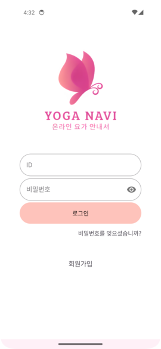
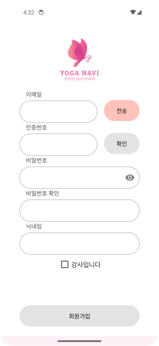

## 1. **홈 탭**에서는 화상강의 목록을 보거나, 입장할 수 있다.

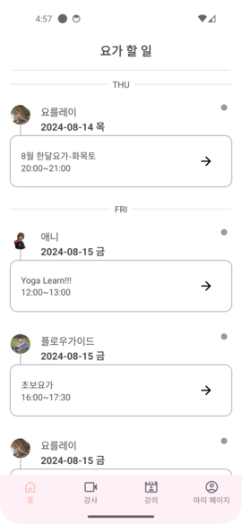

### 1-1. 화상강의 시작 10분 전에 푸시알람을 받을 수 있다.

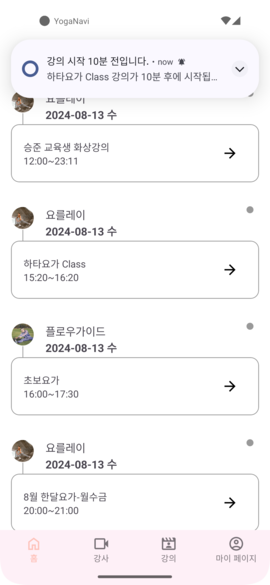

### 1-2. 다이어로그 입장하기 버튼을 누르면 화상강의를 시작할 수 있다.

## 2. **강사 탭**에서는 강사의 목록을 볼 수 있다.

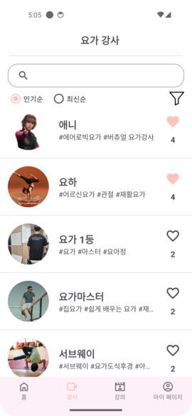

### 2-1. 필터로 원하는 조건의 강사를 찾는 검색이 가능하다.

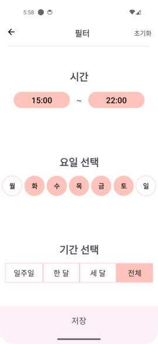

### 2-2. 강사 목록을 클릭하면 강사의 상세 정보를 볼 수 있다. 또한 강사의 수업을 예약할 수 있다.

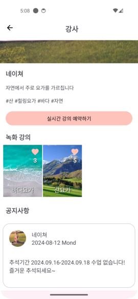

## 3. **강의 탭**에서는 3열 그리드 형식으로 강의 리스트를 볼 수 있고, 원하는 강의의 제목이나 내용을 검색해서 찾을 수 있다.

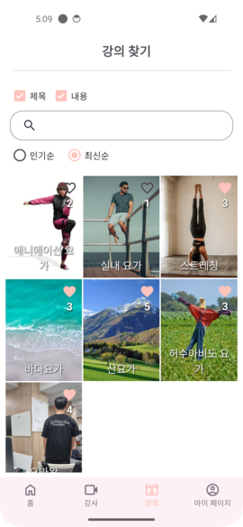
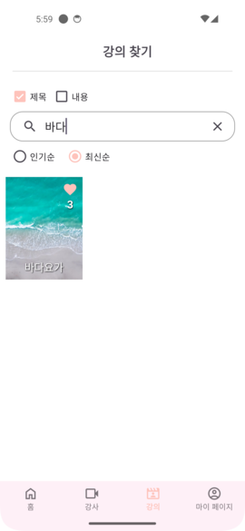

### 3-1. 강의 목록을 클릭하면 강의의 상세 정보를 볼 수 있다.

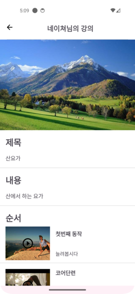

### 3-2. 녹화 강의를 재생하면 수강생의 관절 위치를 표시하고, 각도 정확도에 따른 색깔을 보여준다.

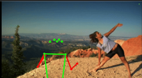

## 4. **마이페이지 탭**에서는 강사일 경우 강의를 관리하고, 수강생의 경우 계정을 관리한다.

### **수강생**

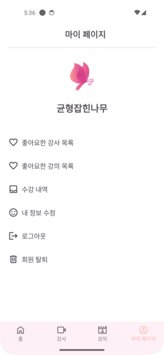

### **강사**

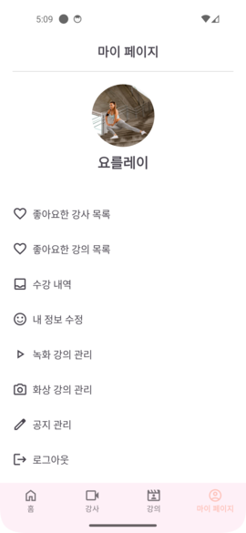

### 4-1. (공용) 마이페이지에서 자신이 좋아요한 강사와 강의를 볼 수 있다.

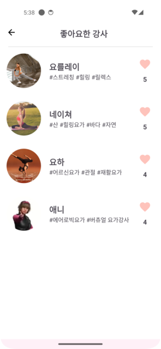

### 4-2. (공용) 마이페이지에서 자신이 수강한 화상강의 내역을 볼 수 있고, 내 정보를 수정할 수 있다. 

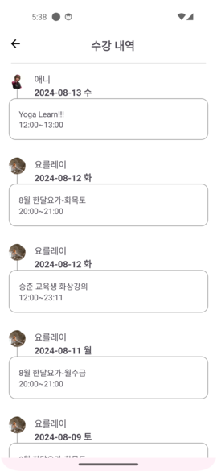
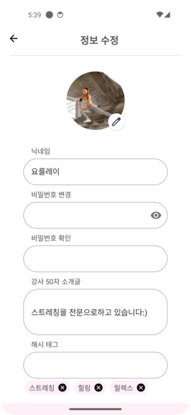

### 4-3. (강사 전용) 녹화 강의를 관리(생성, 수정, 삭제)할 수 있다.

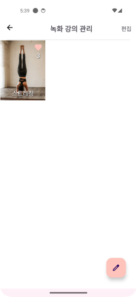
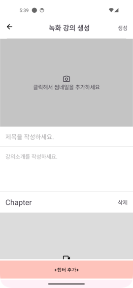

### 4-4. (강사 전용) 화상 관리 일정을 관리(생성, 수정, 삭제)할 수 있다.

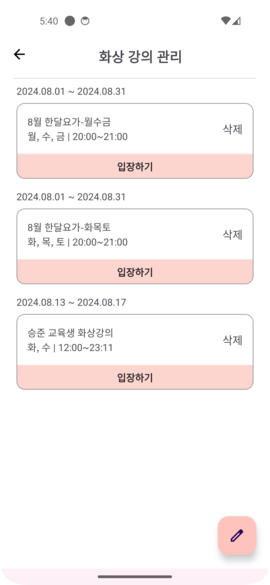
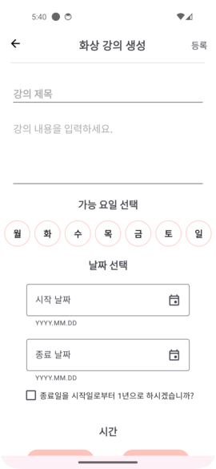

### 4-5. (강사 전용) 공지를 관리(생성, 수정, 삭제)할 수 있다

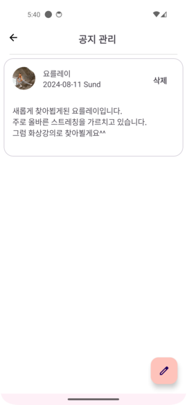

### 4-6. (공용) 로그아웃 및 회원탈퇴를 할 수 있다.

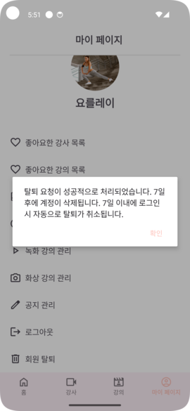
